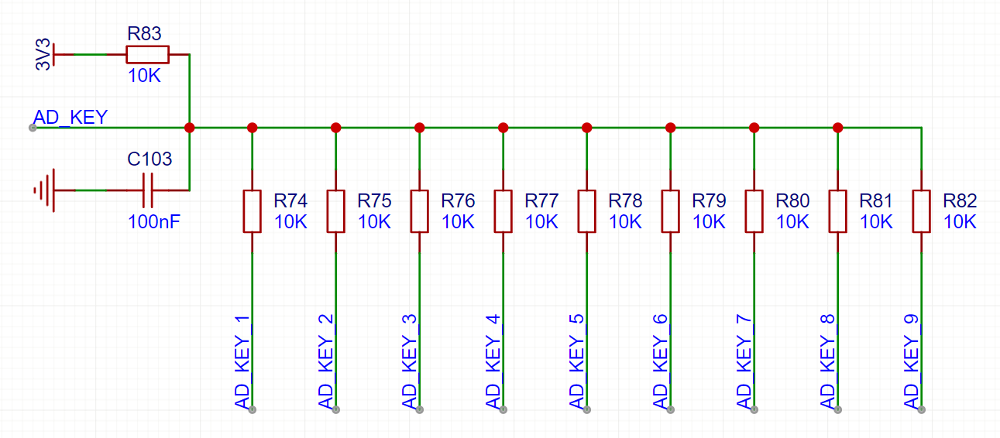

# ADC按键电阻网络优化计算程序说明书

## 一、程序功能
本程序用于优化ADC按键电路的电阻网络参数，支持以下功能：  
1. **标准电阻匹配**：基于国际标准电阻系列（如E12、E24、E96等）查找最接近计算值的实际电阻。  
2. **ADC值计算**：根据电阻分压原理，计算不同公比（电阻衰减系数）下的ADC采集值及相邻差值。  
3. **可视化对比**：通过折线图直观展示不同公比下的ADC值分布和差值变化。  


## 二、依赖环境
### 1. 所需库
- `numpy`：用于数值计算和参数范围生成。  
- `matplotlib`：用于绘制可视化图像。  
- `Python 3.6+`：程序运行的基础环境。  

### 2. 安装命令
```bash
pip install numpy matplotlib
```


## 三、核心函数说明

### 1. `find_closest_resistor(target, series=E, multiplier_range=(1, 1000000))`
**功能**：查找最接近目标阻值的标准电阻值。  
**参数**：  
- `target`（float）：目标电阻值（单位：Ω）。  
- `series`（list）：标准电阻系列（默认使用E192，可替换为E6、E12、E24、E48、E96等列表）。  
- `multiplier_range`（tuple）：电阻值的数量级范围（默认1~1e6，即1Ω~1MΩ）。  
**返回**：最接近目标值的标准电阻值（单位：Ω）。  

### 2. `calculate_adc_values(n=9, adc_max=4095, R_pullup_range=np.linspace(50e3, 400e3, 100), R1_range=np.linspace(500e3, 2000e3, 100), r=0.5)`  
**功能**：计算不同公比下的ADC相关参数（电阻值、ADC采集值、差值等）。  
**参数**：  
- `n`（int）：按键数量（默认9个）。  
- `adc_max`（int）：ADC的最大采集值（默认4095，对应12位ADC）。  
- `R_pullup_range`（numpy.ndarray）：上拉电阻的搜索范围（默认50kΩ~400kΩ，100个均匀值）。  
- `R1_range`（numpy.ndarray）：第一个电阻的搜索范围（默认500kΩ~2000kΩ，100个均匀值）。  
- `r`（float）：电阻衰减公比（默认0.5，需在0~1之间）。  
**返回**：包含计算结果的字典，或`None`（未找到有效参数时）。  

### 3. `plot_adc_results(adc_results)`  
**功能**：绘制不同公比下的ADC采集值和相邻差值折线图。  
**参数**：  
- `adc_results`（list）：包含多个公比计算结果的列表（由`calculate_adc_values`返回值组成）。  


## 四、标准电阻系列
### 标准电阻系列
程序内置以下标准电阻系列（可在代码中直接替换 `series` 参数）：  

| 系列   | 公差   | 标称值数量 | 示例（1.0~10.0Ω范围）                                                                 |  
|--------|--------|------------|---------------------------------------------------------------------------------------|  
| E6     | ±20%    | 6          | `[1.0, 1.5, 2.2, 3.3, 4.7, 6.8]`                                                      |  
| E12    | ±10%    | 12         | `[1.0, 1.2, 1.5, 1.8, 2.2, 2.7, 3.3, 3.9, 4.7, 5.6, 6.8, 8.2]`                       |  
| E24    | ±5%     | 24         | `[1.0, 1.1, 1.2, 1.3, 1.5, 1.6, 1.8, 2.0, 2.2, 2.4, 2.7, 3.0, 3.3, 3.6, 3.9, 4.3, 4.7, 5.1, 5.6, 6.2, 6.8, 7.5, 8.2, 9.1]` |  
| E48    | ±2%     | 48         | `[1.00, 1.05, 1.10, 1.15, 1.21, 1.27, 1.33, 1.40, 1.47, 1.54, 1.62, 1.69, 1.78, 1.87, 1.96, 2.05, 2.15, 2.26, 2.37, 2.49, 2.61, 2.74, 2.87, 3.01, 3.16, 3.32, 3.48, 3.65, 3.83, 4.02, 4.22, 4.42, 4.64, 4.87, 5.11, 5.36, 5.62, 5.90, 6.19, 6.49, 6.81, 7.15, 7.50, 7.87, 8.25, 8.66, 9.09, 9.53]` |  
| E96    | ±1%     | 96         | `[1.00, 1.02, 1.05, 1.07, 1.10, 1.13, 1.15, 1.18, 1.21, 1.24, 1.27, 1.30, 1.33, 1.37, 1.40, 1.43, 1.47, 1.50, 1.54, 1.58, 1.62, 1.65, 1.69, 1.74, 1.78, 1.82, 1.87, 1.91, 1.96, 2.00, 2.05, 2.10, 2.15, 2.21, 2.26, 2.32, 2.37, 2.43, 2.49, 2.55, 2.61, 2.67, 2.74, 2.80, 2.87, 2.94, 3.01, 3.09, 3.16, 3.24, 3.32, 3.40, 3.48, 3.57, 3.65, 3.74, 3.83, 3.92, 4.02, 4.12, 4.22, 4.32, 4.42, 4.53, 4.64, 4.75, 4.87, 4.99, 5.11, 5.23, 5.36, 5.49, 5.62, 5.76, 5.90, 6.04, 6.19, 6.34, 6.49, 6.65, 6.81, 6.98, 7.15, 7.32, 7.50, 7.68, 7.87, 8.06, 8.25, 8.45, 8.66, 8.87, 9.09, 9.31, 9.53, 9.76]` |  
| E192   | ±0.5%   | 192        | `[1.00, 1.01, 1.02, 1.04, 1.05, 1.06, 1.07, 1.09, 1.10, 1.11, 1.13, 1.14, 1.15, 1.17, 1.18, 1.20, 1.21, 1.23, 1.24, 1.26, 1.27, 1.29, 1.30, 1.32, 1.33, 1.35, 1.37, 1.38, 1.40, 1.42, 1.43, 1.45, 1.47, 1.49, 1.50, 1.52, 1.54, 1.56, 1.58, 1.60, 1.62, 1.64, 1.65, 1.67, 1.69, 1.72, 1.74, 1.76, 1.78, 1.80, 1.82, 1.84, 1.87, 1.89, 1.91, 1.93, 1.96, 1.98, 2.00, 2.03, 2.05, 2.08, 2.10, 2.13, 2.15, 2.18, 2.21, 2.23, 2.26, 2.29, 2.32, 2.34, 2.37, 2.40, 2.43, 2.46, 2.49, 2.52, 2.55, 2.58, 2.61, 2.64, 2.67, 2.71, 2.74, 2.77, 2.80, 2.84, 2.87, 2.91, 2.94, 2.98, 3.01, 3.05, 3.09, 3.12, 3.16, 3.20, 3.24, 3.28, 3.32, 3.36, 3.40, 3.44, 3.48, 3.52, 3.57, 3.61, 3.65, 3.70, 3.74, 3.79, 3.83, 3.88, 3.92, 3.97, 4.02, 4.07, 4.12, 4.17, 4.22, 4.27, 4.32, 4.37, 4.42, 4.48, 4.53, 4.59, 4.64, 4.70, 4.75, 4.81, 4.87, 4.93, 4.99, 5.05, 5.11, 5.17, 5.23, 5.30, 5.36, 5.42, 5.49, 5.56, 5.62, 5.69, 5.76, 5.83, 5.90, 5.97, 6.04, 6.12, 6.19, 6.26, 6.34, 6.42, 6.49, 6.57, 6.65, 6.73, 6.81, 6.90, 6.98, 7.06, 7.15, 7.23, 7.32, 7.41, 7.50, 7.59, 7.68, 7.77, 7.87, 7.96, 8.06, 8.16, 8.25, 8.35, 8.45, 8.56, 8.66, 8.76, 8.87, 8.98, 9.09, 9.20, 9.31, 9.42, 9.53, 9.65, 9.76, 9.88]` |  


### 表格说明
- **公差**：电阻值的允许误差范围（如E24系列电阻的实际值与标称值的偏差不超过±5%）。  
- **标称值数量**：每个十年（10^n~10^(n+1)Ω）内的标准阻值数量，数值越大，阻值分布越密集。  
- **示例**：1.0~10.0Ω范围内的标称值，实际使用时可通过乘以 \( 10^n \) 扩展为kΩ、MΩ等（如`1.0`对应1Ω、10Ω、100Ω等）。  

通过替换代码中的 `E = E24` 或其他系列名称，可适配不同精度的电阻选型需求。
## 五、使用步骤

### 1. 导入模块
```python
import numpy as np
import matplotlib.pyplot as plt
from your_module_name import calculate_adc_values, plot_adc_results, find_closest_resistor
```

### 2. 设置参数
#### （1）基础参数
```python
n = 20  # 按键数量（可自定义）
adc_max = 4095  # ADC最大采集值（如12位ADC为4095）
r_values = np.linspace(0.75, 0.85, 5)  # 公比范围（可自定义，建议0.2~0.9）
```

#### （2）电阻系列选择（修改`series`参数）
```python
# 使用E24系列（公差±5%，常用场景）
E = E24  
# 或使用E96系列（公差±1%，高精度场景）
# E = E96  
```

### 3. 计算不同公比下的结果
```python
adc_results = []
for r in r_values:
    result = calculate_adc_values(n=n, r=r, series=E)  # 传入自定义参数
    if result:
        adc_results.append(result)
        # 打印中间结果（可选）
        for key, value in result.items():
            print(f"{key}: {value}")
        print("-" * 80)
```

### 4. 绘制可视化图像
```python
plot_adc_results(adc_results)
```


## 六、主程序示例（`__main__`部分）
```python
if __name__ == "__main__":
    # 公比范围（0.75~0.85，5个均匀值）
    r_values = np.linspace(0.75, 0.85, 5)  
    adc_results = []

    for r in r_values:
        # 计算20个按键的ADC参数（自定义n=20）
        result = calculate_adc_values(n=20, r=r)  
        if result:
            adc_results.append(result)

    # 绘制ADC值和差值的对比图
    plot_adc_results(adc_results)
```


## 七、输出结果说明
### 1. 字典字段解释
- `公比`：电阻衰减系数（如0.8表示后一个电阻是前一个的80%）。  
- `最佳上拉电阻 (kΩ)`：优化后的上拉电阻值（已匹配标准电阻）。  
- `第一个电阻 (kΩ)`：电阻网络的第一个电阻值（已匹配标准电阻）。  
- `电阻值 (kΩ)`：所有按键对应的标准电阻值列表。  
- `ADC 采集值 (0-4095)`：每个按键对应的ADC采集值（0~4095范围）。  
- `相邻ADC采集值差值`：相邻按键的ADC值差异（用于判断按键区分度）。  

### 2. 图像说明
- **ADC采集值折线图**：横轴为按键序号，纵轴为ADC值，不同颜色代表不同公比，直观展示ADC值分布。


- **相邻差值折线图**：横轴为相邻按键序号，纵轴为差值，用于评估按键区分度（差值越大，区分越容易）。


## 八、注意事项
1. **电阻系列选择**：  
   - 通用场景使用`E24`系列，高精度场景使用`E96`或`E192`。  
   - 若电阻值超出`multiplier_range`（如需要10MΩ电阻），需手动扩展`find_closest_resistor`的`multiplier_range`参数。  

2. **参数范围设置**：  
   - `R_pullup_range`和`R1_range`需包含合理的电阻区间（避免过小电阻导致电流过大）。  
   - 公比`r`建议在`0.2~0.9`之间，避免电阻衰减过慢（r接近1）或过快（r接近0）。  

3. **错误处理**：  
   - 若输出“未找到有效的最佳参数”，需调整`R_pullup_range`或`R1_range`，确保电阻值均≥1kΩ（代码中`any(R < 1e3)`会过滤过小电阻）。  

4. **中文字体显示**：  
   - 代码已设置黑体（`SimHei`）显示中文标题，若报错需安装中文字体或修改`plt.rcParams`。  


## 九、程序优势
1. **工程实用性**：直接输出可购买的标准电阻值，避免理论值与实际元件脱节。  
2. **可视化分析**：通过图像快速对比不同公比的ADC值分布，辅助参数优化。  
3. **可扩展性**：支持自定义按键数量、ADC精度、电阻系列，适配不同硬件平台。  

通过调整参数和电阻系列，本程序可广泛应用于Arduino、STM32、ESP32等平台的ADC按键电路设计。